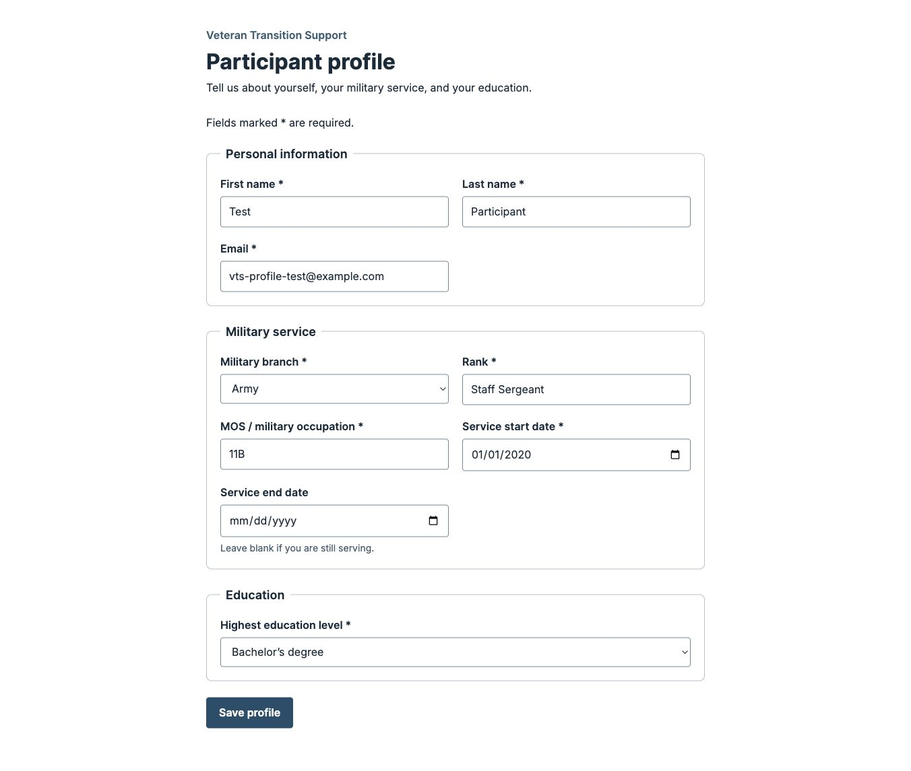

# \[Veteran Transition Support\]

[//]: # "Delete this section when done!"

This project is being built by a team at [Blueprint](https://calblueprint.org), a student organization at the University of California, Berkeley building software pro bono for nonprofits.

## Getting Started

### Prerequisites

Check your installation of `node` and `pnpm`:

```bash
node -v
pnpm -v
```

We strongly recommend using a Node version manager like [nvm](https://github.com/nvm-sh/nvm) (for Mac) or [nvm-windows](https://github.com/coreybutler/nvm-windows) (for Windows) to install Node.js. If you don't plan on switching between different Node versions, you can alternatively get a [prebuilt installer](https://nodejs.org/en/download/prebuilt-installer) from the Node.js website for an easier approach. Make sure to get Node version 20 and up, the latest LTS version should be sufficient.

After installing Node, you most likely have npm installed as well (check by running `npm -v`). If you have npm installed, simply run `npm install -g pnpm` to install pnpm. If your command line does not recognize npm as a command, refer to [this article](https://www.geeksforgeeks.org/how-to-resolve-npm-command-not-found-error-in-node-js/) to troubleshoot.

Additional resources:
- [Downloading and installing Node.js and npm](https://docs.npmjs.com/downloading-and-installing-node-js-and-npm)
- [Installing pnpm without npm](https://pnpm.io/installation)

### Installation

1. Clone the repo & install dependencies

   1. Clone this repo
      - using SSH (recommended)
        ```bash
        git clone git@github.com:calblueprint/veteran-transition-support.git
        ```
      - using HTTPS
        ```bash
        git clone https://github.com/calblueprint/veteran-transition-support.git
        ```
   2. Enter the cloned directory
      ```bash
      cd [veteran-transition-support]
      ```
   3. Install project dependencies. This command installs all packages from [`package.json`](package.json).
      ```bash
      pnpm install
      ```

2. Set up secrets:
   1. In the project's root directory (`veteran-transition-support/`), create a new file named `.env.local`
   2. Copy the credentials from Supabase ([e.g. Blueprint's internal Notion](https://app.notion.com/p/calblueprint/rose-environment-setup-279669c1807580cbbb03dc7a08f8a7d9?source=copy_link#27f669c18075808987facd37d36ab8bd) ) and paste any API keys into the `.env.local` file.

**Helpful resources**

- [GitHub: Cloning a Repository](https://docs.github.com/en/repositories/creating-and-managing-repositories/cloning-a-repository#cloning-a-repository)
- [GitHub: Generating SSH keys](https://docs.github.com/en/authentication/connecting-to-github-with-ssh/generating-a-new-ssh-key-and-adding-it-to-the-ssh-agent)

### Development environment

- **[VSCode](https://code.visualstudio.com/) (recommended)**
  1. Open the `veteran-transition-support` project in VSCode.
  2. Install recommended workspace VSCode extensions. You should see a pop-up on the bottom right to "install the recommended extensions for this repository".

### Running the app

In the project directory, run:

```shell
pnpm dev
```

Then, navigate to http://localhost:3000 to launch the web application.

### Participant profile (Sprint 1)



Visit http://localhost:3000/profile to create or edit a participant profile.
Set `NEXT_PUBLIC_SUPABASE_URL` and `NEXT_PUBLIC_SUPABASE_ANON_KEY` in
`.env.local` using the project URL and public publishable/anon key. Never use a
service-role key in a `NEXT_PUBLIC_` variable.

The page uses the existing `public.participants` table. First name, last name,
and email are included because the database requires them for an insert.
Military branch and education options match the project's database enums.
Service end date is optional for participants who are still serving; when
provided, it must be on or after the start date.

Until authentication is connected, every visit uses the shared test UUID
`e591e956-fb53-41f2-9b28-fc7881ba6c56`, defined in
`actions/supabase/queries/participants.ts`. The first save inserts that record;
subsequent saves update only that record. Existing phone, resume, duplicate,
and creation-date fields are preserved. This is a development-only identity:
replace it with the authenticated participant ID and appropriate RLS policies
before using the page with real participants. This change does not alter the
database schema or access policies.

To verify the flow:

1. Fill out the profile using fictional test information and save.
2. Confirm the row with the test UUID appears in the Supabase Table Editor.
3. Change a field, save again, and reload. The edited value should remain and
   there should still be only one row for that UUID.
4. Try blank required fields, an invalid email, and an end date before the
   start date. These should show validation errors without saving.

Run `pnpm test` for validation tests and `pnpm pre-commit` for the repository's
TypeScript, lint, and formatting checks. Resume upload and auth integration
are deferred to later sprints.

The feature separates rendering, validation, and database access:

- `app/(participant)/profile/page.tsx` owns form state and user feedback.
- `lib/participant-profile.ts` defines profile types, database enum choices,
  field normalization, and validation without React or Supabase dependencies.
- `actions/supabase/queries/participants.ts` loads and saves the test participant.
- `tests/participant-profile.test.mjs` checks validation and data conversion
  offline with Node's built-in test runner. Tests require Node.js 22.9 or newer,
  matching `package.json`, and also run in GitHub Actions.
